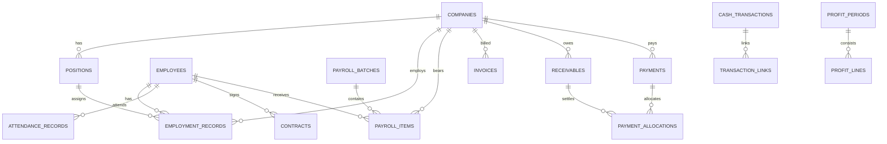

# 劳务派遣经营管理系统数据库设计

状态：初始设计 v1  
更新日期：2026-07-04

## 1. 设计结论

正式环境使用 PostgreSQL。DBeaver 用于人工查看和排查；后端通过 SQLAlchemy 操作数据库；后续使用 Alembic 管理结构版本。

数据库遵循五条原则：

1. 同一业务事实只保存一个权威来源。
2. Excel 原始数据、清洗暂存数据和正式业务数据分层保存。
3. 工资、返费和回款确认后生成关联资金流水，而不是重复手工录入日记账。
4. 财务数据不直接物理删除，使用作废、冲正和版本记录。
5. 所有重要操作和自动计算均可追溯。

## 2. 数据域

| 数据域 | 主要表 | 权威事实 |
|---|---|---|
| 用户权限 | users、roles、permissions | 用户身份和授权 |
| 导入清洗 | files、import_batches、import_rows、import_mappings | 原始文件、清洗过程和来源 |
| 人员用工 | employees、employment_records、attendance_records、contracts | 人员、任职、考勤和合同 |
| 企业合作 | companies、positions、company_qualifications | 企业、岗位和资质 |
| 工资返费 | payroll_batches、payroll_items、recruitment_rebates | 工资和返费业务事实 |
| 开票回款 | invoices、receivables、payments、payment_allocations | 开票、应收和实际回款 |
| 资金日记账 | cash_transactions、transaction_links | 公司实际资金进出 |
| 审批预警 | approval_requests、approval_steps、alerts、alert_actions | 审批过程和风险处理 |
| 利润核对 | profit_periods、profit_lines、reconciliation_items | 期间利润、来源构成和差异 |
| 审计附件 | audit_logs、attachments | 操作记录和文件元数据 |

## 3. 核心关系



## 4. 关键建模决策

### 4.1 人员身份与任职分开

`employees` 保存人员相对稳定的身份资料；企业、岗位、入职和离职历史保存在 `employment_records`。员工换企业或二次入职时不覆盖旧记录。

身份证号不保存可直接检索的明文：

- `id_card_encrypted`：加密后的原值，仅授权场景解密。
- `id_card_hash`：不可逆哈希，用于唯一性判断。
- `id_card_last4`：列表脱敏展示。

### 4.2 日记账统一为单向流水

`cash_transactions` 每行只表达一次收入或支出：

- `direction`：income / expense。
- `amount`：始终为正数。
- `ledger_type`：cash / bank。
- `category`：工资、返费、回款或其他分类。

不使用同一行同时包含 `income_amount` 和 `expense_amount` 的旧结构。原 Excel 并排区域在导入暂存层拆成多条标准记录。

### 4.3 来源关联

`transaction_links` 将资金流水关联到工资、返费、回款等来源。这样日记账展示的是统一资金事实，用户无需重复录入。

第一版用 `source_type + source_id` 支持多业务来源；服务层必须校验来源记录真实存在。若未来来源类型稳定，可进一步拆为显式外键关联表。

### 4.4 开票、应收与回款分开

- `invoices`：已经开出的发票。
- `receivables`：应该收回的款项及到期日。
- `payments`：实际收到的钱。
- `payment_allocations`：一笔回款如何分配到一笔或多笔应收。

该模型支持部分回款、一张发票多次回款和一笔回款结算多张发票。

### 4.5 审批使用通用状态机

`approval_requests` 指向工资批次、返费或其他待审批对象；`approval_steps` 记录每一步操作。业务表保留当前审批状态，完整历史以审批步骤为准。

### 4.6 利润是可追溯结果

`profit_periods` 保存某个期间、某个规则版本的计算结果；`profit_lines` 保存收入和成本构成，并关联来源记录。利润口径变更时生成新版本，不静默覆盖历史结果。

## 5. 通用字段约定

- 主键：`BIGINT GENERATED ALWAYS AS IDENTITY`。
- 时间：`TIMESTAMPTZ`，数据库统一保存时区时间。
- 日期：`DATE`；月份使用该月第一天的 `DATE`。
- 金额：`NUMERIC(18,2)`。
- 数量/工时：根据精度使用 `INTEGER` 或 `NUMERIC(10,2)`。
- 状态：第一版使用 `VARCHAR + CHECK`，避免 PostgreSQL ENUM 难以调整。
- 扩展信息：只在导入原文、规则快照等不稳定结构中使用 `JSONB`。
- 乐观锁：可编辑业务表使用 `version_no`。
- 软删除：普通档案使用 `deleted_at`；财务事实使用作废状态，不删除。

## 6. 唯一性与索引

- 人员：`id_card_hash` 唯一；手机号建普通索引。
- 企业：规范化企业名称唯一；营业执照号非空时唯一。
- 发票：发票号码唯一。
- 导入文件：SHA-256 建索引。
- 导入行：批次、Sheet、行号和区域联合唯一。
- 工资：同一工资批次和员工唯一。
- 考勤：同一任职记录和日期唯一。
- 日记账：交易日期、方向、企业和来源类型建组合索引。
- 预警：同一规则、对象和未解决状态避免重复实例。

## 7. 数据权限

- 一级员工默认只能录入授权模块，不查看利润和全量敏感信息。
- 二级财务可审核工资、返费、开票、回款和资金流水。
- 三级老板可最终确认并查看经营与利润。
- 管理员维护账号、角色和系统配置，但默认不等于业务审批人。
- API 查询必须先应用数据范围权限，再返回结果；不能只依赖前端隐藏。

## 8. 导入三层模型

```text
files
  ↓
import_batches
  ↓
import_rows.raw_data          原始层
  ↓ 标准化与校验
import_rows.normalized_data   暂存层
  ↓ 用户确认提交
employees / cash_transactions / ... 正式业务层
```

正式记录保留 `source_import_row_id`，可以追溯回原始文件、Sheet 和行号。

## 9. 数据联动事务

以工资确认举例，同一事务完成：

1. 校验审批状态。
2. 将工资批次改为已确认。
3. 创建工资资金支出。
4. 创建来源关联。
5. 写审计日志。
6. 标记对应利润期间需要重新计算。

任一步失败则整体回滚，避免工资已确认但日记账没有记录。

## 10. 仍需确认的业务口径

- 利润采用现金口径还是权责口径。
- 银行承兑在收到还是实际兑付时确认回款。
- 工资按工作月份还是实际发薪日期计入成本。
- 返费是否需要关联到具体员工；当前设计允许可选关联。
- 不同企业是否使用不同回款期限和预警阈值。

这些问题不阻塞基础表建立，但会影响利润规则和部分约束。

## 11. 实施顺序

1. 基础、用户权限、附件和审计表。
2. 文件、导入批次、导入行和字段映射表。
3. 企业、岗位、人员、任职、考勤和合同表。
4. 工资、返费和审批表。
5. 发票、应收、回款、资金流水和核对表。
6. 利润、预警及 AI 顾问查询层。

初始可执行 DDL 位于 `backend/sql/schema_v1.sql`。它用于评审和本地初始化；开始正式迁移后，应将其转换为 Alembic 版本脚本。
